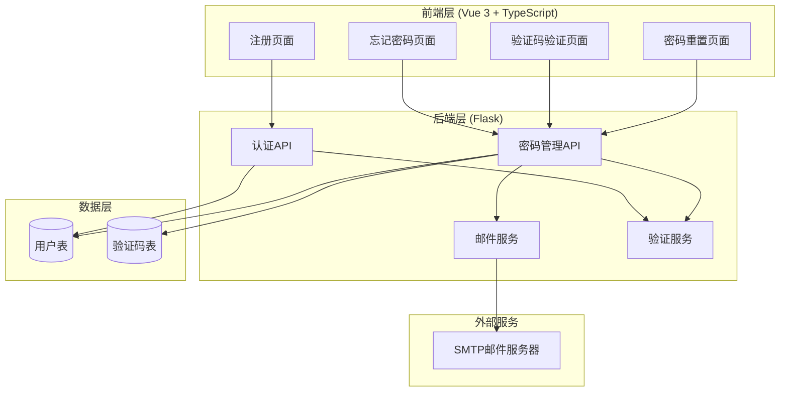
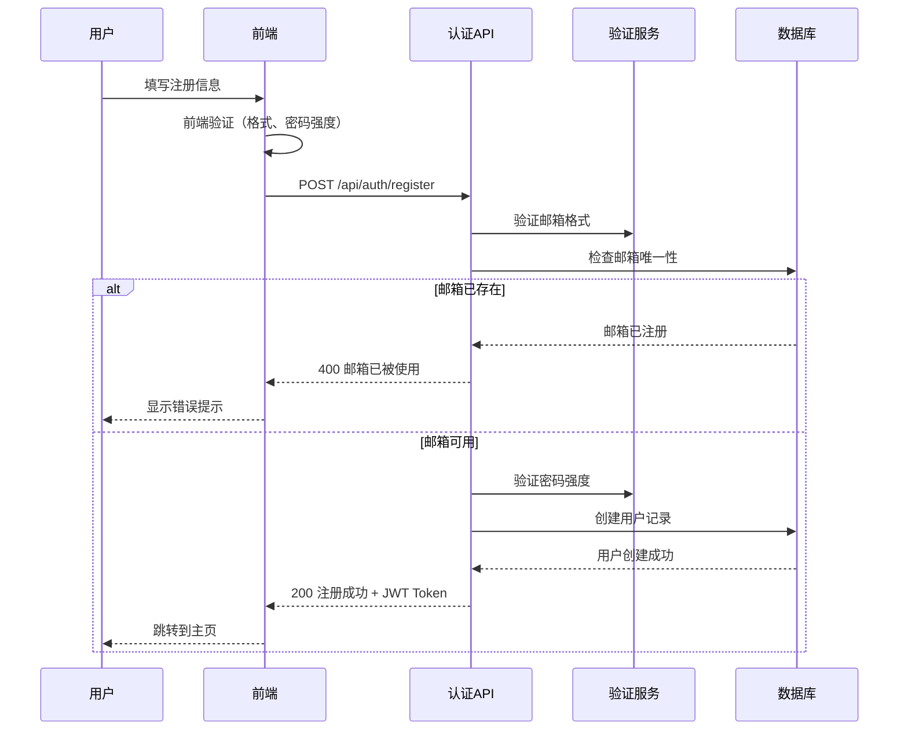
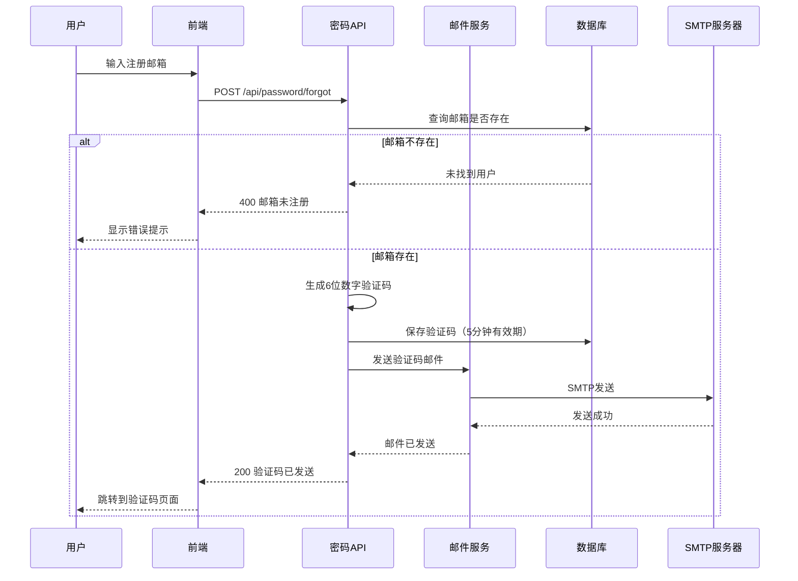
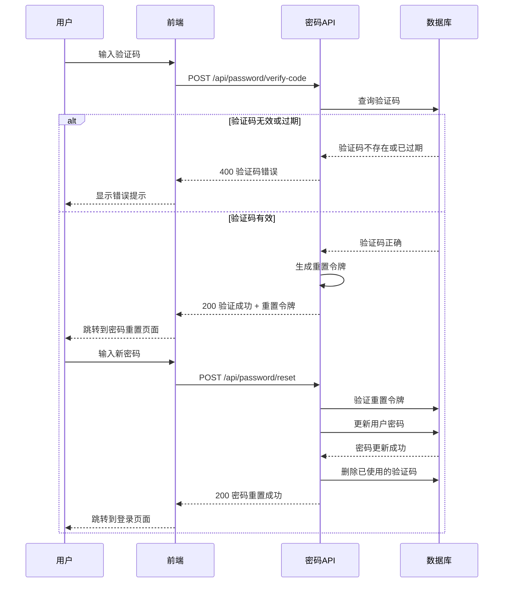

# 设计文档：用户注册与密码管理系统

## 概述

本系统实现完整的用户注册与密码管理功能，包括邮箱验证、密码强度检查、忘记密码流程和密码重置功能。系统采用前后端分离架构，后端使用 Flask + SQLAlchemy + SQL Server，前端使用 Vue 3 + TypeScript + Element Plus。核心安全特性包括邮箱唯一性验证、验证码时效控制、密码加密存储和防暴力破解机制。

## 架构设计

### 系统架构图



### 主要业务流程

#### 用户注册流程




#### 忘记密码流程



#### 验证码验证与密码重置流程



## 组件与接口设计

### 后端组件

#### 1. 用户模型 (User Model)

**目的**: 扩展现有用户模型，添加邮箱字段和相关验证

**接口**:
```python
class User(db.Model):
    __tablename__ = 'users'
    
    id: int
    username: str
    email: str  # 新增字段
    password_hash: str
    display_name: str
    role: str
    is_active: bool
    created_at: datetime
    last_login_at: datetime
    version: int
    
    def set_password(self, password: str) -> None
    def check_password(self, password: str) -> bool
    def to_dict(self) -> dict
```

**职责**:
- 存储用户基本信息和邮箱地址
- 提供密码加密和验证方法
- 序列化用户数据

#### 2. 验证码模型 (VerificationCode Model)

**目的**: 管理密码重置验证码的生成、存储和验证

**接口**:
```python
class VerificationCode(db.Model):
    __tablename__ = 'verification_codes'
    
    id: int
    user_id: int
    email: str
    code: str
    purpose: str  # 'password_reset'
    expires_at: datetime
    is_used: bool
    created_at: datetime
    
    @staticmethod
    def generate_code() -> str
    def is_valid() -> bool
    def mark_as_used() -> None
```

**职责**:
- 生成随机6位数字验证码
- 管理验证码有效期（5-10分钟）
- 跟踪验证码使用状态

